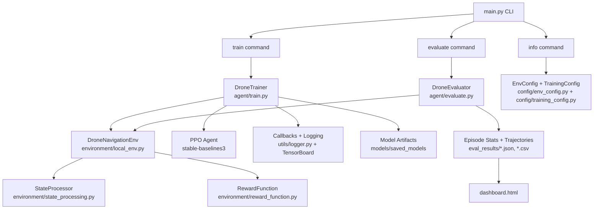

# AeroPath RL

[](https://www.python.org)
[](https://gymnasium.farama.org)
[](https://stable-baselines3.readthedocs.io)
[](LICENSE)

AeroPath RL is an autonomous drone navigation project using reinforcement learning. The agent is trained to fly from spawn to target in 3D space while avoiding collisions using PPO with a local simulator backend.

## Why Reinforcement Learning?

Traditional drone navigation relies on rule-based systems or path planning algorithms (A*, RRT) that require pre-defined maps and explicit obstacle modeling. Reinforcement learning offers:

- **Adaptive Behavior**: The agent learns to handle dynamic, unknown environments without explicit programming
- **End-to-End Learning**: Maps raw sensor observations directly to control actions
- **Collision Avoidance**: Learns safe navigation through trial and error with reward shaping
- **Generalization**: Can adapt to different drone configurations and environments

## What This Repo Includes

- PPO training pipeline for drone navigation
- Evaluation pipeline for single and batch episodes
- Saved model checkpoints and best/final model artifacts
- `dashboard.html` for visualizing trained/evaluation data

## Project Objective

The drone agent learns to:

- Start from spawn position
- Interpret state + distance sensor signals
- Take continuous control actions
- Reach the target safely and efficiently

## System Architecture



```text
+------------------+      +-----------------------------+      +-------------------------+
| Observation      | ---> | PPO Policy (predict action) | ---> | Env Step (apply action) |
| (state+sensors)  |      | action = (vx, vy, vz)       |      | + reward computation     |
+------------------+      +-----------------------------+      +-------------------------+
         ^                                                                      |
         |                                                                      v
         +-------------------- next observation + info + done ------------------+
```

Core runtime data flow:

1. Environment state is generated by `DroneNavigationEnv` using the local simulator client.
2. `StateProcessor` converts position/velocity/sensor values into normalized observation vectors.
3. PPO policy predicts continuous actions `(vx, vy, vz)`.
4. Environment applies the action, computes reward via `RewardFunction`, and returns `(obs, reward, done, info)`.
5. During training, callbacks track metrics and save checkpoints/best/final models.
6. During evaluation, episode trajectories and summary stats are written to `eval_results/` and visualized in `dashboard.html`.

## Quick Start

### Installation

```bash
pip install -r requirements.txt
```

### Show Configuration

```bash
python3 main.py info
```

### Train

```bash
python3 main.py train --timesteps 200000
```

Difficulty examples:

```bash
python3 main.py train --difficulty easy
python3 main.py train --difficulty hard
```

### Evaluate

```bash
python3 main.py evaluate \
  --model models/saved_models/final_drone_ppo.zip \
  --mode batch \
  --n 100 \
  --save \
  --out_dir eval_results/
```

## Dashboard

Dashboard file: `dashboard.html`

Dashboard reads data from:

- `eval_results/eval_stats.json`
- `eval_results/trajectories.csv`
- `logs/*.csv` (optional training log curves)

Run locally:

```bash
python3 -m http.server
```

Then open: `http://localhost:8000/dashboard.html`

## Main Commands

- Train: `python3 main.py train`
- Train with difficulty: `python3 main.py train --difficulty {easy|medium|hard}`
- Resume training: `python3 main.py train --resume <model_path>`
- Evaluate: `python3 main.py evaluate --model <model_path> --mode batch --n 20`
- Evaluate with difficulty: `python3 main.py evaluate --model <model_path> --difficulty {easy|medium|hard}`
- Single episode with live 2D simulation: `python3 main.py evaluate --model <model_path> --mode single --render2d`
- Demo run: `python3 main.py demo --model <model_path>`
