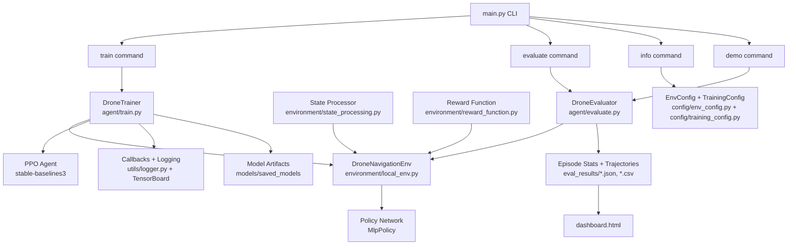

# AeroPath RL


[](https://www.python.org)
[](https://gymnasium.farama.org)
[](https://stable-baselines3.readthedocs.io)
[](LICENSE)

AeroPath RL is an autonomous drone navigation project using reinforcement learning. The agent is trained to fly from spawn to target in 3D space while avoiding collisions using PPO with a local simulator backend.

## Table of Contents
- [Overview](#overview)
- [Why Reinforcement Learning?](#why-reinforcement-learning)
- [Features](#features)
- [Project Structure](#project-structure)
- [System Architecture](#system-architecture)
- [Installation](#installation)
- [Quick Start](#quick-start)
- [Dashboard](#dashboard)
- [Configuration](#configuration)
- [Results & Evaluation](#results--evaluation)
- [License](#license)

## Overview

AeroPath RL implements a complete reinforcement learning pipeline for autonomous drone navigation. The project uses Proximal Policy Optimization (PPO) from Stable-Baselines3 to train an agent that navigates a drone from a spawn position to a target location in 3D space while avoiding obstacles.

## Why Reinforcement Learning?

Traditional drone navigation relies on rule-based systems or path planning algorithms (A*, RRT) that require pre-defined maps and explicit obstacle modeling. Reinforcement learning offers:

| Benefit | Description |
|---------|-------------|
| **Adaptive Behavior** | Learns to handle dynamic, unknown environments without explicit programming |
| **End-to-End Learning** | Maps raw sensor observations directly to control actions |
| **Collision Avoidance** | Learns safe navigation through trial and error with reward shaping |
| **Generalization** | Adapts to different drone configurations and environments |

## Features

- PPO training pipeline with vectorized environments
- Custom drone navigation environment with obstacle generation
- Configurable difficulty levels (easy, medium, hard)
- Comprehensive reward shaping for goal reaching and collision avoidance
- Evaluation pipeline for single and batch episodes
- Model checkpointing and best model saving
- TensorBoard integration for training monitoring
- Rich console logging with progress tracking
- Trajectory saving and visualization dashboard
- Live 2D trajectory visualization during evaluation
- Command-line interface with subcommands

## Project Structure

```
AeroPath RL/
├── agent/
│   ├── train.py        # Training orchestration
│   ├── evaluate.py     # Evaluation pipeline
│   └── model.py        # Policy architecture utilities
├── environment/
│   ├── local_env.py    # Custom drone navigation environment
│   ├── reward_function.py  # Reward computation logic
│   └── state_processing.py # Observation processing
├── config/
│   ├── env_config.py   # Environment parameters
│   └── training_config.py  # Training hyperparameters
├── utils/
│   ├── logger.py       # Training logger (CSV, TensorBoard, Console)
│   └── visualization.py # Trajectory plotting utilities
├── models/
│   └── saved_models/   # Trained model checkpoints
├── eval_results/       # Evaluation results and trajectories
├── dashboard.html      # Interactive results visualization
├── main.py             # CLI entry point
└── requirements.txt    # Project dependencies
```

## System Architecture



### Core Runtime Data Flow

```text
+------------------+      +-----------------------------+      +-------------------------+
| Observation      | ---> | PPO Policy (predict action) | ---> | Env Step (apply action) |
| (state+sensors)  |      | action = (vx, vy, vz)       |      | + reward computation     |
+------------------+      +-----------------------------+      +-------------------------+
          ^                                                                      |
          |                                                                      v
          +-------------------- next observation + info + done ------------------+
```

**Data Flow Steps:**
1. Environment state is generated by `DroneNavigationEnv` using the local simulator client
2. `StateProcessor` converts position/velocity/sensor values into normalized observation vectors
3. PPO policy predicts continuous actions `(vx, vy, vz)`
4. Environment applies the action, computes reward via `RewardFunction`, and returns `(obs, reward, done, info)`
5. During training, callbacks track metrics and save checkpoints/best/final models
6. During evaluation, episode trajectories and summary stats are written to `eval_results/` and visualized in `dashboard.html`

## Installation

```bash
# Clone the repository
git clone https://github.com/ChandanHegde07/AeroPathRL.git
cd AeroPath\ RL

# Install dependencies
pip install -r requirements.txt
```

## Quick Start

### Show Configuration
```bash
python3 main.py info
```

### Train an Agent
```bash
# Default training (1M timesteps, medium difficulty)
python3 main.py train

# Custom timesteps
python3 main.py train --timesteps 500000

# Difficulty levels
python3 main.py train --difficulty easy
python3 main.py train --difficulty hard

# Resume training from checkpoint
python3 main.py train --resume models/saved_models/checkpoints/drone_ppo_ckpt_100000.zip
```

### Evaluate a Trained Agent
```bash
# Single episode with live 2D visualization
python3 main.py evaluate \
  --model models/saved_models/final_drone_ppo.zip \
  --mode single \
  --render2d

# Batch evaluation (100 episodes) and save results
python3 main.py evaluate \
  --model models/saved_models/final_drone_ppo.zip \
  --mode batch \
  --n 100 \
  --save \
  --out_dir eval_results/

# Stochastic evaluation (for exploration analysis)
python3 main.py evaluate \
  --model models/saved_models/final_drone_ppo.zip \
  --mode batch \
  --stochastic
```

### Demo Run
```bash
python3 main.py demo \
  --model models/saved_models/final_drone_ppo.zip
```

## Dashboard

The project includes an interactive HTML dashboard for visualizing training and evaluation results.

**Dashboard Location:** `dashboard.html`

**Data Sources:**
- `eval_results/eval_stats.json` - Evaluation statistics
- `eval_results/trajectories.csv` - Episode trajectory data
- `logs/*.csv` - Training log curves (optional)

**To Run Locally:**
```bash
python3 -m http.server
```
Then open: `http://localhost:8000/dashboard.html`

## Configuration

### Environment Configuration (`config/env_config.py`)
| Parameter | Description | Default |
|-----------|-------------|---------|
| `target_position` | Target coordinates (x, y, z) | (30.0, 0.0, -10.0) |
| `spawn_position` | Starting coordinates (x, y, z) | (0.0, 0.0, -5.0) |
| `goal_tolerance` | Distance threshold for goal reached | 2.0 m |
| `max_velocity` | Maximum drone velocity | 5.0 m/s |
| `num_distance_sensors` | Number of distance sensors | 8 |
| `sensor_max_range` | Maximum sensor range | 20.0 m |
| `difficulty_level` | Environment difficulty | "medium" |
| `dynamic_obstacles` | Enable moving obstacles | True |
| `reward_goal_reached` | Reward for reaching goal | 200.0 |
| `reward_collision` | Penalty for collision | -100.0 |

### Training Configuration (`config/training_config.py`)
| Parameter | Description | Default |
|-----------|-------------|---------|
| `algorithm` | RL algorithm | "PPO" |
| `learning_rate` | Optimizer learning rate | 3e-4 |
| `total_timesteps` | Total training steps | 1,000,000 |
| `n_steps` | Steps per update | 2048 |
| `batch_size` | Minibatch size | 64 |
| `n_epochs` | Policy update epochs | 10 |
| `gamma` | Discount factor | 0.99 |
| `ent_coef` | Entropy coefficient | 0.01 |
| `net_arch` | Network architecture | [256, 256] |
| `n_envs` | Number of parallel environments | 1 |
| `use_curriculum` | Enable curriculum learning | False |

## Results & Evaluation

After training, evaluation results are stored in the `eval_results/` directory:

- `eval_stats.json` - Summary statistics (success rate, mean reward, etc.)
- `trajectories.csv` - Full trajectory data for all evaluation episodes
- Various PNG visualizations:
  - Reward curves and components
  - Sensor heatmaps
  - 3D trajectory plots
  - Episode summaries

**Key Metrics:**
- **Success Rate**: Percentage of episodes reaching the target
- **Mean Reward**: Average episode reward
- **Collision Rate**: Percentage of episodes ending in collision
- **Mean Path Length**: Average distance traveled per episode
- **Mean Steps**: Average episode length in steps

## License

This project is licensed under the MIT License - see the [LICENSE](LICENSE) file for details.

## Acknowledgments

- Built with [Stable-Baselines3](https://stable-baselines3.readthedocs.io/)
- Uses [Gymnasium](https://gymnasium.farama.org/) for environment interface
- Visualization powered by [Matplotlib](https://matplotlib.org/) and [Plotly](https://plotly.com/)

